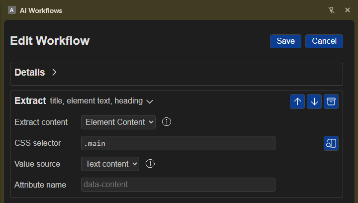

# Extract

## Overview

Use **Extract** to collect information from the webpage in your active browser tab. You can use the page title, headings, links, buttons, form fields, highlighted text, or page content in later workflow steps. No separate sign-in is needed. Only regular websites can be read; built-in browser pages and local files are not supported.

## Simple examples

- Collect an article's visible text so a later step can summarize it.
- Use text you highlighted on the page as input for another step.
- Pick a particular page element to capture its text, a form value, or a link or image address.

## Add and configure the step

1. Open the webpage you want to use and make its tab active.
2. Add **Extract** to your workflow.
3. Under **Extract content**, choose what you need:
   - **Selection** uses text you highlighted on the page.
   - **Full Text** collects visible text from across the page.
   - **Clean HTML** collects page content with scripts and styles removed.
   - **Element Content** collects information from one part of the page.
4. For **Element Content**, click **Pick / View Element**, then click the item on the webpage. Under **Value source**, choose what to collect:
   - **Text content** collects the visible text in the selected item.
   - **Value** collects the current value of a form field.
   - **Attribute** collects a detail such as a link or image address. Enter the detail's name under **Attribute name**.
5. In a later workflow step, use the token picker to insert the Extract information you need, such as the page title, links, or selected content.

