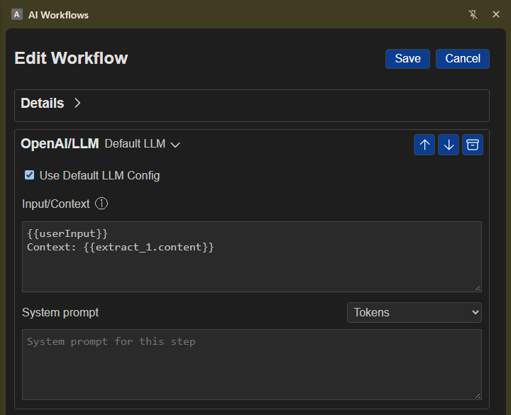

# OpenAI/LLM

## Overview

Use **OpenAI/LLM** to send instructions and context to an AI provider and make its response available to later workflow steps. You can use the default provider settings or enter different settings for this step.

## Simple examples

- Summarize text collected from a webpage.
- Draft a response using information someone enters when the workflow runs.
- Rewrite or organize information from earlier workflow steps.

## Set up an AI provider

You need an API key for the provider you want to use.

- To use saved default settings, open **Settings > General > Default LLM**, choose a **Provider**, enter its **OpenAI endpoint**, **API Key**, and **Model**, then save. In the workflow step, leave **Use Default LLM Config** selected.
- To use different settings for this step, clear **Use Default LLM Config**, then choose a **Provider** and enter its endpoint, API key, and model in the step.

The provider menu includes presets and an option for a custom endpoint.

## Add and configure the step

1. Add **OpenAI/LLM** to your workflow.
2. Under **Input/Context**, enter the information you want the AI to use. By default, this includes workflow user input and content from an earlier **Extract** step.
3. Under **System prompt**, give optional instructions for how the AI should respond.
4. Use the token picker in these fields to include information from earlier workflow steps.
5. To let someone enter information each time the workflow runs, add the user-input value from the token picker to **Input/Context**. A text field then appears on the workflow's run page.
6. Use the AI response in later steps by selecting it with the token picker.
