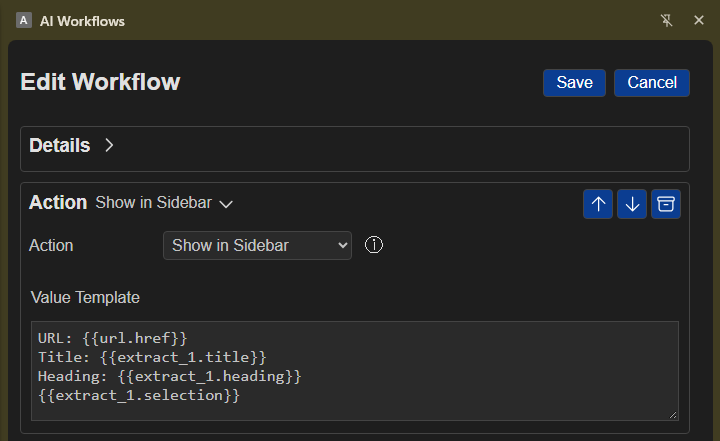

# Page Action

## Overview

Use **Action** to control a webpage, manage browser tabs, or display and save workflow results. Some actions work with the active webpage; others work with browser tabs or the extension sidebar.

## Simple examples

- Fill a webpage's search box and press Enter.
- Wait for search results to appear, then save a summary in **View Content**.
- Show a workflow result in the sidebar.

## Before you start

Actions that interact with webpage content need an active website tab. Chrome's built-in pages and blank tabs cannot be controlled this way. For **Click Element**, **Update Field**, **Wait for Selector**, or **Key Press**, click **View Element** and select the page item instead of typing its CSS selector yourself.

## Choose an action

Select an action from the **Action** menu:

- **Show in Sidebar** displays text or workflow results in the sidebar's **Result** area.
- **Append Content** saves text in **View Content**, where you can review, copy, or download saved clippings.
- **Navigate to URL** opens a web address in the active tab. Only HTTP or HTTPS addresses are supported; a path can be relative to the current website.
- **Switch to Tab** activates a tab by its web address or title. If you provide a web address that is not already open, it opens in a new tab.
- **Close Tab** closes a tab that matches the address or title you enter.
- **Refresh Tab** reloads the active tab.
- **Click Element** clicks a selected page item, such as a button or link.
- **Update Field** enters text into one page field.
- **Update Multiple Fields** enters text into several fields at once. This option requires a structured list of fields and values.
- **Wait/Delay** pauses the workflow for the number of seconds you enter.
- **Wait for Selector** waits up to 10 seconds for a page element to appear.
- **Key Press** sends a supported key, such as Enter or Tab, to the active field or selected page item.

**Auto** is also listed in the menu, but it does not currently perform an action.

## Configure the selected action

1. Choose the action you want to perform.
2. If the form shows **CSS Selector**, use **View Element** to select the page item. This is needed for actions such as clicking an item, updating a field, or waiting for an item to appear.
3. If the form shows **Value Template**, enter the text, web address, delay, or key required by that action. You can include results from earlier workflow steps.

When you use **Append Content**, choose **View Content** to open the saved clippings.
